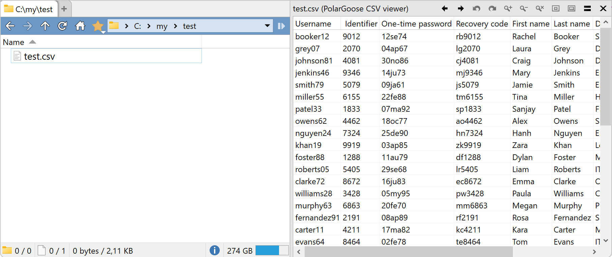

# DirectoryOpus-CSV-viewer-plugin
A viewer plugin for Directory Opus that displays CSV files as a table.

# Features
* Automatically detects the `,` or `;` delimiter.
* Automatically detects if the first row is a header.
* Supported encodings: `UTF-8`, `UTF-8 BOM`, `UTF-16LE`, `UTF16BE`
* Displays only the first 1MB of the file content.
* Selected rows can be copied to the clipboard by pressing `Ctrl+C`.

# How to use
* Download the zipped `DLL` file from the [releases page](https://github.com/PolarGoose/DirectoryOpus-CSV-viewer-plugin/releases)
* Copy the `DLL` file to `C:\Program Files\GPSoftware\Directory Opus\Viewers` folder
* Restart Directory Opus
* Every time you select a `.csv` file, the plugin will be used to show the content in the Viewer Pane.

# References
* Discussion of this plugin on Directory Opus forum: [CSV viewer 2](https://resource.dopus.com/t/csv-viewer-2/56568)
